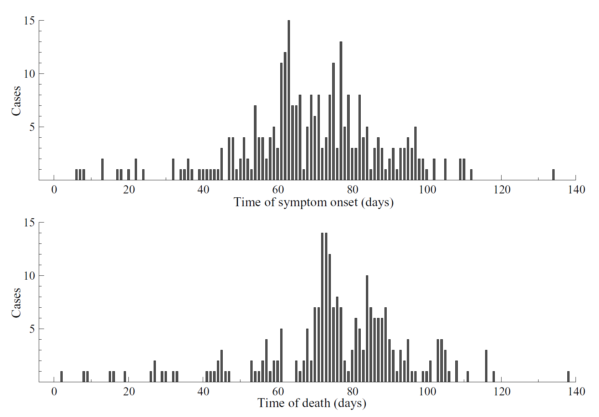

--- 
title: "Case Study 0: 1995 DRC Ebola outbreak"
author: "Danny Scarponi"
site: bookdown::bookdown_site
output:
    bookdown::pdf_book:
        includes:
            in_header: header.tex
    bookdown::gitbook:
        config:
            sharing: null
        css: 'style.css'
        includes:
            in_header: _toggle.html
        keep_md: TRUE
linkcolor: blue
documentclass: book
link-citations: yes
description: "Skeleton Tutorial Template"
---
# Introduction
This is the first of a series of tutorials that illustrate the process for using the Bayes Linear History Matching with Emulation (HME) package [emulatorr](https://github.com/Tandethsquire/emulatorr). 


# Description of epidemiological problem
The case study is based on an outbreak of Ebola Hemorrhagic Fever that took place in Kikwit, Democratic Republic of the Congo, in 1995. We give here a brief description of the circumstances in which the epidemic originated and of the measures put in place to characterize and contain it. More details about the outbreak can be found in the article [The Reemergence of Ebola Hemorrhagic Fever, Democratic Republic of the Congo, 1995](https://academic.oup.com/jid/article/179/Supplement_1/S76/882543.), by Khan et al.

In May 1995, the Centers for Disease Control and Prevention
(CDC) was notified of an outbreak of viral hemorrhagic fever in Kikwit, DRC. Specimens sent to Belgium were forwarded to CDC for diagnostic
testing, and the presence of acute or recent EBO virus infection
was confirmed for all 14 persons tested.
Within 48 h of diagnostic
confirmation, a multinational contingent led by the World Health Organization (WHO), composed of physicians, epidemiologists, sanitarians, health educators, and logistic support
personnel were dispatched to assist DRC authorities in controlling and characterizing the outbreak.

**Index Patient and Initial Cluster of Cases**
The first identified case-patient was GM, a 42-year-old male
charcoal worker and farmer who became ill on 6 January
and died of a febrile hemorrhagic disease at Kikwit General Hospital on 13 January 1995. He directly infected at least 3 members of his family, all of whom died, and an additional 10 secondary cases (all fatal) occurred among members of his extended family over the next 9 weeks in an area encompassing Kikwit and 3 surrounding villages.

In ealy April1995, a small nosocomial cluster of EBO 
cases among the nursing staff at Kikwit II Maternity Hospital 
was first recognized but misdiagnosed as epidemic dysentery. 
Toward the end of April, a similar nosocomial cluster was 
identified at Kikwit General Hospital among the operating room
staff who participated in a surgical procedure on a laboratory technician
employed at Kikwit II Maternity Hospital.

**Surveillance and case-finding**


**Time course of the Epidemic**
At least four generations of cases were traced through the hospital and into the community from the initial nosocomial cases in Kikwit General Hospital (figure 1).


# Description of model and input parameters
We consider a stochastic (continuous/discrete time?) SEIR model. The human host population is divided into the categories of susceptible (S), infected, but not yet infectious (E), infectious (I) and removed (R). Assuming a homogeneous closed population of size $N$ (i.e. with negligible births, deaths or migration) and homogeneous mixing within the population, the rate of transition of an individual from $S\rightarrow E$ can be modelled as being proportional to the proportion of infective individuals in the population. The rates of transition from $E \rightarrow I$ and 
$I \rightarrow R$ are constant.   

If $S_t, E_t, I_t$ and $R_t$ are the numbers of susceptible, infected but not yet infectious, infectious and removed individuals in the population at time $t$, and $dt$ is a vanishingly small time period such that only one event can occur in $[t,t+dt]$, then we can write the probabilities of events within the population as 
\begin{align}
P(S\rightarrow E)&=\beta N^{-1}S_t I_t dt+ o(dt) (\#eq:align1) \\
P(E\rightarrow I)&= \delta E_tdt+o(dt)  (\#eq:align2)\\
P(I\rightarrow R)&= \gamma I_tdt +o(dt) (\#eq:align3)
\end{align} 
The notation $S\rightarrow E$ corresponds to the movement of a single individual from the state $S$ to the state $E$ (likewise for the other possible transitions). Here $\beta$ is the transition parameter, $\delta^{-1}$ is the mean incubation period and $\gamma^{-1}$ is the mean infectious period. While we assume $\delta$ and $\gamma$ to be constant, we will let $\beta$ be time-dependent. This is because we need to account for the intervention strategies put in place to control the spread of Ebola. We assume that the transmission rate is constant up to the point of intervention $t_{\text{int}}$, before decaying exponentially to zero:
\begin{equation} \beta_t =
  \begin{cases}
    \beta \quad&   t< t_\text{int}  \\
    \beta e^{-q(t-t_{\text{int}})} & t\geq t_\text{int}.
  \end{cases}   (\#eq:betat)
\end{equation}
Note that the $\gamma$ is not affected by the interventions, since the disease is not curable.

The epidemic model specified by \@ref(eq:align1)-\@ref(eq:betat) has parameter vector $\Theta=\{\beta, q, \gamma, \delta\}$, which we would like to estimate from the available data.

# Description of fitting outputs
## Description of data on 1995 Ebola DRC outbreak
The data consist of two time series
(see Figure below) recorded from March 1 to July 16, namely,
daily counts of Ebola cases by date of symptom onset, accounting
for a total of 291 cases, and daily counts of deaths
from Ebola, accounting for a total of 236 deaths. It is also
documented that the first case became ill on January 6, 1995,
the last case died on July 16, and a total of 316 cases were
identified resulting in a rate of 81% fatality. 

The epidemic lasted for about 200 days with control measures
being introduced about 130 days after the start of the
epidemic. The exact starting time and evolution of the epidemic
prior to March 1 is unobserved. Furthermore, from the
total number of 316 identified cases, it can be deduced that
the dates of symptom onset for 25 cases and the dates of removal
from the infectious class for 80 cases are not reported
in the given time series.

```{r, echo=FALSE}
library(knitr)
library(png)

```


## Missing data handling
# Description of calibration methodology
## Construction of emulators
### General structure of an emulator (role of various parameters)
### Sampling points (training/validation points)
### Training first emulators           
## Emulator diagnostics 
### Implausibility measure (choice of cut-off)
### Various forms of diagnostics 
#### Simulator/emulator outputs comparison 
#### Standard error of emulator outputs 
#### Emulator/simulator implausibility 
## Points generation 
## Further waves
<!--
# TJ material
```{r, child = "_setup.Rmd", include = F, purl = F, cache = F}
```

Basically a standard Bookdown template with a few tweaks. New chapters need to be in separate '.Rmd' files, where each file starts with a chapter heading as seen [here](https://bookdown.org/yihui/bookdown/usage.html). In order to use the task and solution blocks in \LaTeX, you must input the order of the files into the `_bookdown.yml` file, and the first file must be called `index.Rmd` e.g.

```
rmd_files:
    html: ['index.Rmd', 'ch1.Rmd']
    latex: ['index.Rmd', 'ch1.Rmd', 'ch_appendix.Rmd']
output_dir: "docs"
```

The `latex:` path above ***must*** have `'ch_appendix.Rmd'` as its last entry. This ensures that the appendix is properly formatted for the solutions to the problems.

You must have the following lines at the start of your `index.Rmd` file:

````
```{r, child = "_setup.Rmd", include = F, purl = F, cache = F}`r ''`
```
````

There are a couple of useful special blocks. A `task` block, and a `solution` block. These can be used as e.g.

````
```{task}`r ''`
Here is a task written in **markdown**.
```
````

which renders as:

```{task}
Here is a task written in **markdown**.
```

You can include chunks within the `task` chunk, but you need to use double backticks *within* the chunk, and leave carriage returns around the internal chunk e.g.

````

```{task}`r ''`

``{r}
x <- 2 + 2
x
``

```

````

which renders as:

```{task}

``{r}
x <- 2 + 2
x
``

```

Be careful to have suitable carriage returns around e.g. `enumerate` or `itemize` environments inside the chunk also. For example:

````

```{task}`r ''`
Here is a list:
1. item 1
2. item 2
```

```` 

will not render nicely. But

````

```{task}`r ''`
Here is a list:

1. item 1
2. item 2

```

```` 

will:

```{task}
Here is a list:

1. item 1
2. item 2

```

The `solution` chunk works in the same way, and the numbers will follow the previous `task` chunk (so you can set tasks without solutions) e.g.

````

```{task}`r ''`
Add 2 and 2 together
```

```{solution}`r ''`

``{r}
2 + 2
``

```

````

gives:

```{task}
Add 2 and 2 together
```

```{solution}

``{r}
2 + 2
``

```

## Additional extensions

### Different task and solution titles

Task and solution boxes can also be given different names using the `title` option e.g.

````

```{task, title = "Question"}`r ''`
What is the meaning of life, the universe and everything?
```

```{solution, title = "Answer"}`r ''`
Why 42 of course!
```

````

gives:

```{task, title = "Question"}
What is the meaning of life, the universe and everything?
```

```{solution, title = "Answer"}
Why 42 of course!
```

### Turning tasks and solutions on and off

Sometimes you might want to hide task and/or solution boxes. This can be done with the `renderTask` and `renderSol` chunk options, which can be set globally or locally. For example:

````

```{task, title = "Question"}`r ''`
Can I set a task and not show the answer?
```

```{solution, title = "Answer", renderSol = FALSE}`r ''`
Indeed, though you won't see this answer unless `renderSol = TRUE`...
```

````

typesets as:

```{task, title = "Question"}
Can I set a task and not show the answer?
```

```{solution, title = "Answer", renderSol = FALSE}
Indeed, though you won't see this answer unless `renderSol = TRUE`...
```

### Tabbed boxed environments

Originally developed to put base R and `tidyverse` solutions side-by-side, using a `multCode = T` option to the solution box. Here the two tabs are separated by four consecutive hashes: `####`, and the `titles` option gives the tab titles (these can be set globally if preferred) e.g.

```{r, include = F}
library(tidyverse)
```

````

```{task}`r ''`
Filter the `iris` data by `Species == "setosa"` and find the mean `Petal.Length`.
```

```{solution, multCode = T, titles = c("Base R", "tidyverse")}`r ''`

``{r}
## base R solution
mean(iris$Petal.Length[
    iris$Species == "setosa"])
``

####

``{r}
## tidyverse solution
iris %>% 
    filter(Species == "setosa") %>%
    select(Petal.Length) %>%
    summarise(mean = mean(Petal.Length))
``
    
```

````

will typeset to:

```{task}
Filter the `iris` data by `Species == "setosa"` and find the mean `Petal.Length`.
```

```{solution, multCode = T, titles = c("Base R", "tidyverse")}

``{r}
## base R solution
mean(iris$Petal.Length[
    iris$Species == "setosa"])
``

####

``{r}
## tidyverse solution
iris %>% 
    filter(Species == "setosa") %>%
    select(Petal.Length) %>%
    summarise(mean = mean(Petal.Length))
``
    
```

Note that there is also a `multCode` chunk that does not link to task and solution boxes e.g.

````

```{multCode}`r ''`

Two options: 

* Option 1

####

Two options:
    
* Option 2

```

````

will typeset to:

```{multCode}

Two options: 

* Option 1

####

Two options:
    
* Option 2

```

The `titles` option can be set as before.
-->