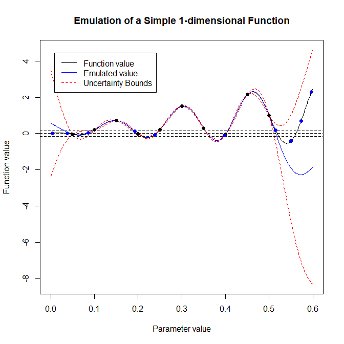
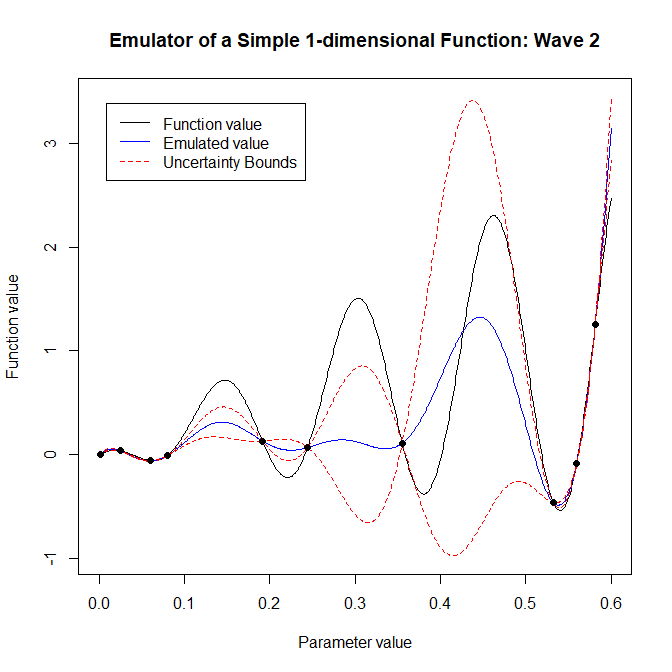

--- 
title: "Tutorial 1: An introduction to History Matching and Emulation, and the hmer package"
author: "Andy Iskauskas, Danny Scarponi"
site: bookdown::bookdown_site
output:
    bookdown::pdf_book:
        includes:
            in_header: header.tex
    bookdown::gitbook:
        config:
            sharing: null
        css: 'style.css'
        highlight: tango
        includes:
            in_header: _toggle.html
        keep_md: TRUE
linkcolor: blue
documentclass: book
link-citations: yes
description: "An overview of the history matching with emulation process"
---


# Introduction

This short tutorial gives an overview of history matching with emulation and shows how to implement this technique in a one-dimensional example using the [hmer](https://cran.r-project.org/web/packages/hmer/index.html) package. 

In this section, we introduce the concepts of history matching and emulation and explain how their combined use provides us with a way of calibrating complex computer models.

Computer models, otherwise known as simulators, have been widely used in almost all fields in science and technology. This includes the use of infectious disease models in epidemiology and public health. 
A computer model is a way of representing the  fundamental dynamics of a system. Due to the complexity of the interactions within a system, computer models frequently contain large numbers of parameters. 

Before using a model for projection or planning, it is fundamental to explore plausible values for its parameters, calibrating the model to the observed data. This poses a significant problem, considering that it may take several minutes or even hours for the evaluation of a single scenario of a complex model. This difficulty is compounded for stochastic models, where hundreds or thousands of realisations may be required for each scenario.  As a consequence, a comprehensive analysis of the entire input space, requiring vast numbers of model evaluations, is often unfeasible. Emulation, combined with history matching, allows us to overcome this issue.

## History Matching

History matching concerns the problem of identifying those parameter sets that may give rise to acceptable matches between the model outputs and the observed data. History matching proceeds as a series of iterations, called waves, where implausible areas of parameter space, i.e. areas that do not give rise to a match with the observed data,  are identified and discarded. Each wave focuses the search for implausible space in the space that was characterized as non-implausible in all previous waves: thus the non-implausible space shrinks with each wave. To decide whether a parameter set $x$ is implausible we introduce the implausibility measure, which evaluates the difference between the model results and the observed data, weighted by how uncertain we are at $x$. If such measure is too high, the parameter set is discarded in the next wave of the process. 

Note that history matching as just described still relies on the evaluation of the model at a large number of parameter sets, which is often unfeasible. Here is where emulators play a crucial role.

## Emulators   

A long established method for handling computationally expensive models is to first construct an emulator: a fast statistical approximation of the model that can be used as a surrogate. In other words, we can think of an emulator as a way of representing our 
<span class="abbr" title="In Bayesian statistics, probability expresses a degree of belief in an event. Such belief can be based either on prior knowledge or on personal beliefs about the event. Note that this approach differs from the frequentist interpretation, that defines the probability of an event as the limit of its relative frequence in many trials."><abbr title="In Bayesian statistics, probability expresses a degree of belief in an event. Such belief can be based either on prior knowledge or on personal beliefs about the event. Note that this approach differs from the frequentist interpretation, that defines the probability of an event as the limit of its relative frequence in many trials.">beliefs</abbr></span> about the behaviour of a complex model. Note that one can either construct an emulator for each of the model output separately, or combine outputs together, through more advanced techniques. From here on we assume that each model output will have its own emulator.

The model is run at a manageable number of parameter sets to provide training data for the emulator. The emulator is then built and can be used to obtain an expected value of the model output at any parameter set $x$, along with a corresponding uncertainty estimate reflecting our beliefs about the uncertainty in the approximation. 

Emulators have two useful properties. First, they are computationally efficient - typically several orders of magnitude faster than the computer models they approximate. Second, they allow for the uncertainty in their approximations to be taken into account. These two properties mean that emulators can be used to make inferences as a surrogate for the model itself. In particular, when going through the history matching process, it is possible to evaluate the implausibility measure at any given parameter set by comparing the observed data to the emulator output, rather than the model output. This greatly speeds up the process and allows for a comprehensive exploration of the input space.

## History matching and emulation in a nutshell
Figure \@ref(fig:fig3)  shows a typical history matching workflow. 

<div class="figure" style="text-align: center">

<p class="caption">(\#fig:fig3)History matching and emulation flowchart</p>
</div>

The various steps of the process can be summarised as follows:

1) A number of parameter sets are selected. 
2) The model is run at the selected parameter sets.
3) Emulators are built using the training data provided by the previous step. Note that here we initially choose to construct separate emulators, one for the mean of each model output, but more advanced approaches are possible.
4) Emulators are evaluated at a large number of parameter sets. The implausibility of each of these is then assessed.
5) Parameter sets classified as non-implausible will be used in the next wave of the process. From here, we go back to step 2).

Each time we get to step 5) we need to decide if to go for another wave or to stop the process. One stopping criterion consists in having all model runs at the current non-implausible space close enough to the targets: this means that we have  fitted our model and we don't need to perform another wave of history matching. In some other cases we might notice that the uncertainty of current emulators is smaller than the uncertainty in the targets: this implies that the non-implausible space is unlikely to decrease in size in the next wave and therefore it is best to stop the process. Finally we might end up
with all the input space deemed implausible at the end of a wave. In this situation, we would deduce that there are no parameter sets that give an acceptable match with the data: in particular, this would raise doubts about the adequacy of the chosen model.

In the next section we give a very simple example of history matching and emulation to help the reader familiarise themselves with the procedure.

# One-dimensional Example

To show how history matching and emulation work, we present a one-dimensional example,  i.e. our model will have only one parameter. Our focus here is on the various steps of the process, rather than on the use of the [hmer](https://cran.r-project.org/web/packages/hmer/index.html) package. A more detailed introduction to the functionalities of [hmer](https://cran.r-project.org/web/packages/hmer/index.html) can be found in [Tutorial 2](https://danny-sc.github.io/Tutorial_2/).

## Setup

The model we consider is a single univariate deterministic function:

\(f(x) = 2x + 3x\sin\left(\frac{5\pi(x-0.1)}{0.4}\right).\)

Through this very simple example we demonstrate the main features of emulation and history matching over a couple of waves. Moreover, since $f(x)$ can be evaluated quickly, we will be able to compare the emulator performance against the actual function very easily.


```r
func <- function(x) {
  2*x + 3*x*sin(5*pi*(x-0.1)/0.4)
}
```

We will presume that we want to emulate this function over the input range $x\in[0,0.6]$. To train an emulator to this function, we'll evaluate $f$ at equally spaced-out points along the parameter range: $10$ points will be ample for training a one-dimensional emulator.


```r
data1d <- data.frame(x = seq(0.05, 0.5, by = 0.05), f = func(seq(0.05, 0.5, by = 0.05)))
```

For demonstration purposes we put no points between $0.5$ and $0.6$ in `data1d`: we will comment on the effects of this choice at the end of the first wave. Note that the value of $f$ is considered unknown for all values of $x$ outside `data1d`. The points in `data1d` will be passed to the [hmer](https://cran.r-project.org/web/packages/hmer/index.html) package, in order for it to train an emulator to the function `func`, interpolate points between the data points above, and propose a new set of points for training a second-wave emulator.

## Emulator Training

To train the emulator, we first define the ranges of the parameters. Note that we create a list of one element, which seems pointless here but generalises easily to multi-output emulation.


```r
ranges1d <- list(x = c(0, 0.6))
```

To build our emulator we use the function `emulator_from_data`, which requires at least three things: the training data `data1d`, the name(s) of the outputs to emulate, and the ranges of the input parameters `ranges1d`:


```r
em1d_1 <- emulator_from_data(data1d, c('f'), ranges1d)
```

This trained emulator takes into account the fact that we know the values at the 10 points in the dataset. Correspondingly, the variance at these ten points (which we get through the `get_cov` method to `em1d_1$f`) is $0$ and the expectation  (which we get through the `get_exp` method to `em1d_1$f`) exactly matches the function value (up to numerical precision). 


```r
em1d_1$f$get_cov(data1d)
#>  [1] 0 0 0 0 0 0 0 0 0 0
em1d_1$f$get_exp(data1d) - data1d$f
#>  [1]  6.078471e-15 -7.771561e-16 -1.609823e-14 -2.908784e-14 -2.342571e-14
#>  [6] -1.532108e-14 -8.493206e-15 -8.770762e-15 -1.021405e-14 -5.551115e-15
```

We can use this trained emulator to predict the value at many points along the input range. Let's define a large set of points to evaluate at, and get the emulator expectation and variance at each of these points.


```r
test_points <- data.frame(x = seq(0, 0.6, by = 0.001))
em_exp <- em1d_1$f$get_exp(test_points)
em_var <- em1d_1$f$get_cov(test_points)
```

Because in this particular example the function to emulate is straightforward to evaluate, we will put all the test points into the actual function too. We create a data.frame with everything we need for plotting.


```r
plotting1d <- data.frame(
  x = test_points$x,
  f = func(test_points$x),
  E = em_exp,
  max = em_exp + 3*sqrt(em_var),
  min = em_exp - 3*sqrt(em_var)
)
```

We now plot a set of items: the actual function (in black), the emulator expectation for the function (in blue), and $3\sigma$ uncertainty bounds corresponding to the emulator variance (in red). We also plot the locations of the training points to demonstrate the vanishing variance at those points.


```r
plot(data = plotting1d, f ~ x, ylim = c(min(plotting1d[,-1]), max(plotting1d[,-1])),
     type = 'l', main = "Emulation of a Simple 1-dimensional Function", xlab = "Parameter value", 
     ylab = "Function value")
lines(data = plotting1d, E ~ x, col = 'blue')
lines(data = plotting1d, min ~ x, col = 'red', lty = 2)
lines(data = plotting1d, max ~ x, col = 'red', lty = 2)
points(data = data1d, f ~ x, pch = 16, cex = 1)
legend('topleft', inset = c(0.05, 0.05), legend = c("Function value", "Emulated value", "Uncertainty Bounds"),
       col = c('black', 'blue', 'red'), lty = c(1,1,2))
```


We can note a few things from this plot. Firstly, the emulator does exactly replicate the function at the points used to train it (the black dots). The variance, i.e. the distance between the two red lines, increases the further away we get from a 'known' point, and indeed the emulator expectation starts to deviate from the actual function value. This is evident if we look at the area in between $0.5$ and $0.6$: since `data1d` contains no value in that interval, our emulator is particularly uncertain there. However, note that the actual value (the black line) never falls outside the $3\sigma$ bounds given by the emulator variance.

## History Matching

Now suppose that we want to find input points which result in a given output value. Obviously, with this function we can easily do this either analytically or numerically, but for complex models this is simply not possible. We therefore follow the history matching approach.

The first thing we need is a target value: let's suppose we want to find points $x$ such that $f(x)=0$, plus or minus $0.05$. Then we define our target as follows:


```r
target1d <- list(f = list(val = 0, sigma = 0.05))
```

Again, the use of a list of lists is to ensure it generalises to multiple outputs.

We can now use the function `generate_new_runs` to obtain a new set of points for the second wave. There are a multitude of different methods that can be used to propose the new points: in this particular one-dimensional case, it makes sense to take the most basic approach. This is to generate a large number of space-filling points, reject those that the emulator rules out as implausible, and select the subset of the remaining points that has the maximal minimum distance between them (so as to cover as much of the non-implausible space as possible). This can be done by setting `method` to `lhs` (Latin Hypercube sampling) and `measure.method` to `maximin`: 


```r
new_points1d <- generate_new_runs(em1d_1, 10, target1d,
                                  method = 'lhs', 
                                  measure.method = 'maximin')
```
 
The output `new_points1d` consists of 10 points that were deemed non-implausible by the emulator `em1d_1`.

Having obtained these new points, let's include them on our plot (blue dots) to demonstrate the emulator's logic.


```r
plot(data = plotting1d, f ~ x, ylim = c(min(plotting1d[,-1]), max(plotting1d[,-1])),
     type = 'l', main = "Emulation of a Simple 1-dimensional Function", xlab = "Parameter value", 
     ylab = "Function value")
lines(data = plotting1d, E ~ x, col = 'blue')
lines(data = plotting1d, min ~ x, col = 'red', lty = 2)
lines(data = plotting1d, max ~ x, col = 'red', lty = 2)
points(data = data1d, f ~ x, pch = 16, cex = 1)
legend('topleft', inset = c(0.05, 0.05), legend = c("Function value", "Emulated value", "Uncertainty Bounds"),
       col = c('black', 'blue', 'red'), lty = c(1,1,2))
abline(h = target1d$f$val, lty = 2)
abline(h = target1d$f$val + 3*target1d$f$sigma, lty = 2)
abline(h = target1d$f$val - 3*target1d$f$sigma, lty = 2)
points(x = unlist(new_points1d, use.names = F), y = func(unlist(new_points1d, use.names = F)), 
       pch = 16, col = 'blue')
```




There is a crucial point here. While the emulator has proposed points that lie in the desired range (particularly on the left hand side of the interval), it has also proposed points that certainly do not lie in that range. However, at these points  the range is contained within the band given by the emulator uncertainty bounds. Consider the right hand side of the interval: since the emulator has high variance there, it cannot rule out this region as unfeasible. This is the reason why `generate_new_runs` proposes points there: in this way, when a new emulator will be trained in the second wave of the process, it will be much more certain about the function value than our current emulator in the interval $[0.5,0.6]$. This will allow the new emulator to rule out the area quickly.

## Second Wave

The second wave is very similar to the first one: the model is evaluated at points in `new_points1d` and the outputs are used to train new emulators.  


```r
new_data1d <- data.frame(x = unlist(new_points1d, use.names = F), f = func(unlist(new_points1d, use.names = F)))

em1d_2 <- emulator_from_data(new_data1d, c('f'), ranges1d)
em1d_2_results <- data.frame(E = em1d_2[[1]]$get_exp(test_points), V = em1d_2[[1]]$get_cov(test_points))
plotting1d2 <- data.frame(x = plotting1d$x, f = plotting1d$f, E = em1d_2_results$E,
                          max = em1d_2_results$E + 3*sqrt(abs(em1d_2_results$V)),
                          min = em1d_2_results$E - 3*sqrt(abs(em1d_2_results$V)))
plot(data = plotting1d2, f ~ x,  ylim = c(min(plotting1d2[,-1]), max(plotting1d2[,-1])),
     type = 'l', main = "Emulator of a Simple 1-dimensional Function: Wave 2", xlab = "Parameter value", 
     ylab = "Function value")
lines(data = plotting1d2, E ~ x, col = 'blue')
lines(data = plotting1d2, max ~ x, col = 'red', lty = 2)
lines(data = plotting1d2, min ~ x, col = 'red', lty = 2)
points(data = new_data1d, f ~ x, pch = 16, cex = 1)
legend('topleft', inset = c(0.05, 0.05), legend = c("Function value", "Emulated value", "Uncertainty Bounds"), 
       col = c('black', 'blue', 'red'), lty = c(1,1,2))
```



This plot underlines the importance of using all waves of emulation. The first wave is trained over the entire space, and so gives a moderately confident estimate of the true function value on the interval $[0, 0.6]$. The second-wave emulator is trained only on regions that we need to be more certain of, i.e. on regions where the first-wave emulator was less certain. This is reflected for example on the fact that most points in `new_data1d` are above $0.5$ or below $0.1$. As a result, the second-wave emulator is much more certain than the first-wave emulator when $x$ is above $0.5$ or below $0.1$. On the contrary, the second-wave emulator is particularly uncertain in the central region: this does not pose a problem, since the first-wave emulator was already approximating the model very well in that area. This is the reason why, when generating new non-implausible points at the end of the second wave, we must search for points with implausibility below three according to both the first- and the second-wave emulator:


```r
new_new_points1d <-  generate_new_runs(c(em1d_2, em1d_1), 10, z = c(target1d, target1d),
                                      method = 'lhs', measure.method = 'maximin')
plot(data = plotting1d2, f ~ x, ylim = c(min(plotting1d2[,-1]), max(plotting1d2[,-1])),
     type = 'l', main = "Emulator of a Simple 1-dimensional Function: Wave 2", xlab = "Parameter value", 
     ylab = "Function value")
lines(data = plotting1d2, E ~ x, col = 'blue')
lines(data = plotting1d2, max ~ x, col = 'red', lty = 2)
lines(data = plotting1d2, min ~ x, col = 'red', lty = 2)
points(data = new_data1d, f ~ x, pch = 16, cex = 1)
legend('topleft', inset = c(0.05, 0.05), legend = c("Function value", "Emulated value (wave 2)",
                                                    "Uncertainty Bounds"), col = c('black', 'blue', 'red'), 
                                                    lty = c(1,1,2))
abline(h = target1d$f$val, lty = 2)
abline(h = target1d$f$val + 3*target1d$f$sigma, lty = 2)
abline(h = target1d$f$val - 3*target1d$f$sigma, lty = 2)
points(x = unlist(new_new_points1d, use.names = F), y = func(unlist(new_new_points1d, use.names = F)), 
       pch = 16, col = 'blue')
```


At the end of the second wave we see that all proposed points (in blue) are within the target bounds. For this reason we can end here the history matching process.


<!--
# TJ material


```
rmd_files:
    html: ['index.Rmd', 'ch1.Rmd']
    latex: ['index.Rmd', 'ch1.Rmd', 'ch_appendix.Rmd']
output_dir: "docs"
```


-->

<!--chapter:end:index.Rmd-->

